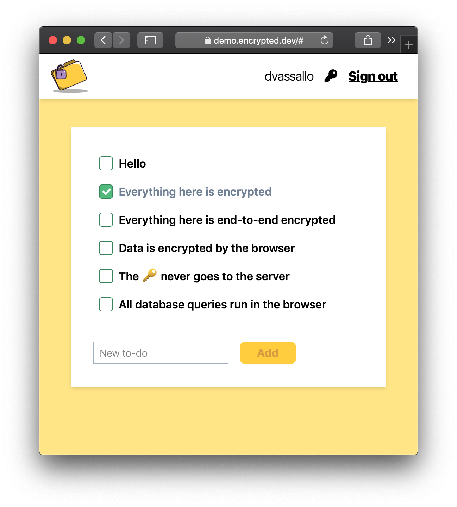

[](https://encrypted.dev)

# An end-to-end encrypted web app
This is a simple to-do web app, with a twist: All user data is end-to-end encrypted!

The to-do data gets encrypted by the browser with an AES-256 key that never goes to the server. The app user gets data privacy, while the app developer gets spared from the burden of handling user data. A win-win.

For now, this is just a prototype app. It is a proof of concept to demonstrate that web apps like this can work and perform adequately without server-side database queries. With end-to-end encryption, all database queries happen in the browser. The server is there to handle access control and store the encrypted data.

## Demo

Check out https://demo.encrypted.dev for a live demo.

[](https://demo.encrypted.dev)

## SDK

#### Auth

Creating a new user account:
```
await auth.signUp('username', 'password')
```

Signing in:
```
await auth.signIn('username', 'password')
```

Signing out:
```
await auth.signOut()
```

#### Database

Inserting an item:
```
let milk = await db.insert({ task: 'Buy 1 gallon of milk' })
```

Searching for an item:
```
let milk = (await db.query()).find(e => e.record.task.includes('milk'))
```

Updating an item:
```
await db.update(milk, { task: 'Buy 5 gallons of milk' })
```

Deleting an item:
```
await db.delete(milk)
```

## Development

Add your AWS credentials in `~/.aws/credentials` under a profile called "encrypted":

```
echo "
[encrypted]
aws_access_key_id=<YOUR ACCESS KEY>
aws_secret_access_key=<YOUR SECRET KEY>" >> ~/.aws/credentials
```

Check out the repo:

```
git clone https://github.com/encrypted-dev/proof-of-concept.git
```

Install the dependencies:

```
npm install
```

Start the dev server:

```
npm start
```

Go to http://localhost:3000 and you should see the welcome screen.

## Performance Test

Make sure no other tabs with localhost:3001 are open, then run:

```
npm run perftest
```

A browser should open to localhost:3001. Open the browser console. You should see logs indicating the test is setting up. Wait until the test is finished setting up and the following message is logged:

```
To test user <username>, input this into the console: localStorage.setItem('key', <user's key>), then sign in with password 'Test1234'.
```

Copy the entire `localStorage.setItem()` function.

Once copied, run:

```
npm start
```

A browser should open to localhost:3000 with the normal app this time. Open the browser console and paste to set the user's encryption key. Then sign in with the username and password from above. Results on the query operation will be shown in the console.

## License

This project is released under the [MIT License](LICENSE).
